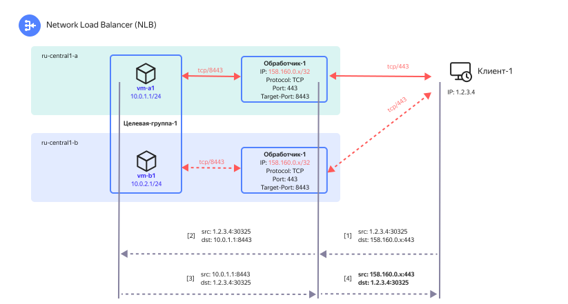

# Особенности реализации

## Обработчик во всех зонах доступности {#nlb-vip}

IP-адрес [обработчика трафика](listener.md) балансировщика анонсируется во внешний мир как префикс `/32` из всех [зон доступности](../../overview/concepts/geo-scope.md) {{ yandex-cloud }}. При выходе из строя одной зоны доступности, входящий трафик на IP-адрес обработчика будет перенаправлен сетевым оборудованием в другие работающие зоны доступности.

## Потоки трафика {#nlb-flows}

Рассмотрим алгоритм работы внешнего (`EXTERNAL`) балансировщика:

1. Обработчик принимает от граничного маршрутизатора {{ yandex-cloud }} трафик (набор пакетов) для IP-адреса и порта на которые он настроен.
2. Обработчик вычисляет `5-tuple` хеш-функцию от параметров принятого IP-пакета. В хеш-функцию передаются:
    * Протокол передачи информации — TCP или UDP.
    * Публичный IP-адрес отправителя.
    * TCP- или UDP-порт отправителя.
    * Публичный IP-адрес обработчика трафика балансировщика.
    * TCP- или UDP-порт обработчика трафика балансировщика.
3. В соответствии с результатом вычисления хеш-функции обработчик направляет трафик на один из живых ресурсов в целевой группе.
4. Ресурс в группе, получивший от обработчика трафик, выполняет его обработку и отправляет результат обратно сетевому балансировщику.

Ниже на схеме представлен пример работы клиентского приложения из Интернет веб-сервисом в {{ yandex-cloud }}

Путь трафика от клиентского приложения к веб-сервису проходит следующий путь:

1. Трафик от клиентского приложения `1.2.3.4:30325` *(номер сокета/порта может быть любой)* в виде последовательности IP-пакетов отправляется к балансировщику NLB и обработчик трафика `158.160.0.x:443` получает его.
1. Обработчик вычисляет `5-tuple` хеш-функцию от параметров принятого IP-пакета и принимает решение отправить его к ВМ `vm-a1` в целевой группе. Виртуальная сеть сохраняет информацию о том, что трафик на обработчик `158.160.0.x:443` был отправлен к ресурсу `10.0.1.1:8443`
1. После обработки полученного запроса, ВМ `vm-a1` отвечает в сторону клиентского приложения от своего IP-адреса - `10.0.1.1`. Трафик уходит от ВМ через шлюз по-умолчанию в виртуальную сеть.
1.Виртуальная сеть уже знает (см. п.2), что ранее трафик от клиентского приложения был принят обработчиком балансировщика и отправлен на обработку к ВМ `vm-a1`. Эта информация даёт возможность виртуальной сети поменять адрес и порт отправителя (сделать source NAT) для всех пакетов от `10.0.1.1:8443` к `158.160.0.x:443`. Далее трафик отправляется к адресу назначения согласно политикам маршрутизации и доходит до клиентского приложения.



На схеме выше пунктиром показан резервный путь к ВМ `vm-b1`, который выбрал бы обработчик, если проверка доступности для ВМ `vm-a1` была бы неудачной.



## Обработка UDP трафика {#nlb-udp}

Обработка UDP-трафика для сетевого балансировщика по умолчанию выключена. 

Такое поведение обусловлено отсутствием консистентности в балансировке UDP трафика: не гарантируется распределение IP-пакетов, у которых одинаковый 5-tuple хеш на обработку, на один и тот же ресурс в целевой группе. При таком распределении можно применять сетевой балансировщик для обработки, например, трафика протокола DNS, где не требуется сохранение состояния соединения.

Для включения обработки UDP-трафика на сетевом балансировщике требуется обращение в [техническую поддержку](../../support/overview.md).

## Локальность при обработке трафика внутренним балансировщиком {#nlb-int-locality}

Если клиент, находящийся внутри {{ vpc-short-name }}, отправляет трафик на внутренний сетевой балансировщик, то обработчик будет распределять этот трафик только по ресурсам в целевых группах, которые находятся в той же зоне доступности, что и клиент. 

При отсутствии живых целевых ресурсов в той же зоне доступности где находится клиент, трафик будет равномерно распределяться по целевым ресурсам в других зонах.

## Сходимость маршрутизации в зоне доступности {#nlb-zone-converge}

При отключении (неуспешной проверке состояния) последнего целевого ресурса в зоне доступности, эта зона будет «исключена» из маршрутизации трафика через балансировщик. Процесс сходимости протоколов маршрутизации при этом может занимать до 2 минут. В течение этого интервала сходимости трафик, поступающий на данный целевой ресурс, будет отбрасываться.

Когда в работу вернется первый целевой ресурс в зоне доступности после успешной проверки состояния, фактический возврат ресурса к обработке трафика произойдет также спустя интервал сходимости, необходимый для анонсирования префикса ресурса из данной зоны доступности.

## Сетевой балансировщик и {{ interconnect-name }} {#nlb-cic}

При использовании внутреннего сетевого балансировщика допускается взаимодействие между IP-адресом обработчика балансировщика и ресурсами на удаленной площадке (On-Prem).

Поскольку сетевой балансировщик и ресурсы в целевых группах за ним должны быть в одной сети, использование в составе групп балансировщика ресурсов из On-Prem не допускается.

## Маршрутизация трафика через внутренний балансировщик {#nlb-int-routing}

Внутренний сетевой балансировщик использует маршруты всех подсетей в выбранной сети {{ vpc-name }}. К ним относятся динамические маршруты из [{{ interconnect-name }}](../../interconnect/) и [статические маршруты](../../vpc/concepts/static-routes.md) из таблиц маршрутизации VPC.

Если в таблице маршрутизации у нескольких маршрутов будет одинаковый префикс назначения, но разные [next hop](https://en.wikipedia.org/wiki/Hop_(networking)#Next_hop) адреса, то исходящий трафик от целевых ресурсов балансировщика будет распределяться по этим next hop адресам. Учитывайте эту особенность, когда к балансировщику приходит трафик через сетевые виртуальные машины (например, межсетевые экраны), которые могут отслеживать входящие и исходящие потоки трафика и не допускают ассиметрии при его передаче.

Если трафик к балансировщику не проходил через сетевую ВМ, она может отбросить ответный трафик от целевых ресурсов. Для избежания потерь трафика необходимо настроить маршрутизацию в зависимости от вашего случая:

* [таблицы маршрутизации имеют статические маршруты с одинаковыми префиксами](#same-prefixes);
* [на сетевых ВМ настроен Source NAT](#source-nat);
* [таблицы маршрутизации имеют статические маршруты с одинаковыми префиксами и разными next hop адресами сетевых ВМ](#divergent-next-hop).

#### Таблицы маршрутизации имеют статические маршруты с одинаковыми префиксами {#same-prefixes}

У маршрутов должен быть next hop адрес одной из сетевых ВМ. Сетевые ВМ работают в режиме `Active/Standby`. Для обеспечения отказоустойчивости исходящего трафика настройте переадресацию трафика, например с помощью [route-switcher](https://github.com/yandex-cloud/yc-architect-solution-library/tree/main/yc-route-switcher-v2).

#### На сетевых ВМ настроен Source NAT {#source-nat}

На ВМ необходимо настроить трансляцию [Source NAT](https://en.wikipedia.org/wiki/Network_address_translation#SNAT) в адреса сетевых ВМ. Сетевые ВМ работают в режиме `Active/Active`. Для настройки Source NAT обратитесь к документации ПО, развернутого на сетевой ВМ. Посмотрите [пример настройки Source NAT](../../tutorials/routing/high-accessible-dmz.md#setup-static-nat) на Check Point NGFW.

#### Таблицы маршрутизации имеют статические маршруты с одинаковыми префиксами и разными next hop адресами сетевых ВМ {#divergent-next-hop}



Данный сценарий не поддерживается. Используйте один из вариантов, описанных выше.



