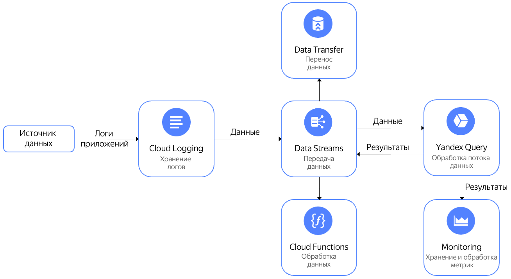

# Анализ логов Cloud Logging

[{{ cloud-logging-name }}](../../logging/quickstart.md) - это сервис, позволяющий читать и записывать логи сервисов Облака и пользовательских приложений.

С помощью {{ cloud-logging-name }} можно передавать логи приложений в {{ yq-full-name }} для их обработки в реальном времени. Обработанные данные можно отправить:
- В {{ monitoring-name }} для нанесения на графики и алертинга.
- Записать в другой поток {{ yds-full-name }}, откуда данные можно отправить на обработку в {{ sf-name }} или в {{ data-transfer-name }} [для отправки в различные системы хранения](../../data-streams/tutorials/data-ingestion.md).

Ниже приведена архитектура решения с {{ cloud-logging-short-name }}.


Пример запроса, который по каждому хосту считает число отправленных сообщений, сгруппированным по 10-секундным интервалам:

```sql
$cloud_logging_data = 
SELECT 
    CAST(JSON_VALUE(data, "$.timestamp") AS Timestamp) AS `timestamp`,
    JSON_VALUE(data, "$.jsonPayload.host") AS host
FROM bindings.`cloud-logging`;

SELECT 
    host, 
    COUNT(*) AS message_count, 
    HOP_END() AS `timestamp`
FROM $cloud_logging_data
GROUP BY 
    HOP(`timestamp`, "PT10S", "PT10S", "PT10S"), 
    host
LIMIT 2;
```

Описание работы с потоковыми данными, получаемыми из {{ yds-full-name }}, находится в разделе [Чтение данных из Data Streams](../sources-and-sinks/data-streams.md).

## Настройка {#setup}

Для настройки необходимо выполнить следующие шаги:
1. [Создать поток данных {{ yds-full-name }}](#create_yds_stream).
1. [Создать лог-группу](#create_log_group).
1. [Инициировать отправку данных в лог-группу](#send_to_loggroup).
1. [Создать соединение](#create_connection) с потоком данных.
1. [Создать привязку к данным](#create_binding) к потоку данных.
1. [Выполнить запрос](#query) к данным из лог-группы.

### Создание потока данных {{ yds-full-name }} {#create_yds_stream}

Создание [потока данных](../../data-streams/operations/manage-streams.md) подробно описано в [документации {{ yds-full-name }}](../../data-streams/operations/manage-streams.md).

### Создание лог-группы {#create_log_group}

Для создания [лог-группы](../../logging/concepts/log-group.md) с опцией отправки данных в поток {{ yds-full-name }} выполните следующую команду:

```shell
yc logging group create \
  --name <log_group_name> \
  --folder-id <folder_id> \
  --data-stream <full_yds_stream_name>
```

Где:

* `name` — название создаваемой лог-группы.
* `folder-id` — каталог, где будет создана лог-группа.
* `data-stream` — полное имя потока данных {{ yds-full-name }}. Полное имя потока можно получить в UI {{ yds-full-name }} в разделе **Подключиться**. Полное имя потока имеет формат `/{{ region-id }}/b1kmrhakmf8ar1i5l6f8/etnku2bpm9r7sgbpq7s7/cloud-logging`.

Пример команды создания лог-группы `yds`, отправляющей данные в поток `cloud-logging`:

```shell
yc logging group create \
  --name yds \
  --folder-id b1kmrhakmf8ar1i5l6f8 \
  --data-stream /{{ region-id }}/b1kmrhakmf8ar1i5l6f8/etnku2bpm9r7sgbpq7s7/cloud-logging
```

### Отправка данных в лог-группу {#send_to_loggroup}

Для отправки данных в лог-группу воспользуйтесь следующей командой:

```shell
do yc logging write \
  --group-name=<log_group_name> \
  --message='<message>' \
  --timestamp="1s ago" \
  --level=INFO \
  --json-payload='<json_payload>' \
  --folder-id <folder_id>;
```  

Где:

* `group-name` — название лог-группы.
* `message` — текст сообщения.
* `json_payload` — дополнительные данные сообщения в формате JSON.
* `folder-id` — каталог, где создана лог-группа.

Пример команды для отправки данных в лог-группу `yds`, находящуюся в фолдере `b1kmrhakmf8ar1i5l6f8`, сообщения `Message` с дополнительным JSON-содержимым `{"request_id": "1234", "host":"test_host"}`:

```shell
while true; do yc logging write \
  --group-name=yds \
  --message="Message" \
  --timestamp="1s ago" \
  --level=INFO \
  --json-payload='{"request_id": "1234", "host":"test_host"}' \
  --folder-id b1kmrhakmf8ar1i5l6f8; \
  sleep 1; \
done
```  

### Создание подключения в {{ yq-full-name }} {#create_connection}

Создайте [соединение](../concepts/glossary.md#connection) с именем `cloud-logging-connection`, для этого нужно выполнить следующие действия:



### Создание привязки к данным в {{ yq-full-name }} {#create_connection}

Создайте [привязку к данным](../concepts/glossary.md#binding) к {{ yds-full-name }} с именем `cloud-logging` и шаблоном данных **Cloud Logging**, для этого нужно выполнить следующие действия:



## Запрос к данным {#query}

В редакторе запросов в интерфейсе {{ yq-full-name }} выполните следующий запрос:

```sql
$cloud_logging_data = 
SELECT 
    CAST(JSON_VALUE(data, "$.timestamp") AS Timestamp) AS `timestamp`,
    JSON_VALUE(data, "$.jsonPayload.host") AS host
FROM bindings.`cloud-logging`;

SELECT 
    host, 
    COUNT(*) AS message_count, 
    HOP_END() AS `timestamp`
FROM $cloud_logging_data
GROUP BY 
    HOP(`timestamp`, "PT10S", "PT10S", "PT10S"), 
    host
LIMIT 2;
```






