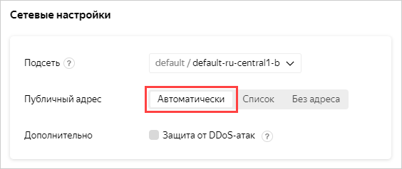
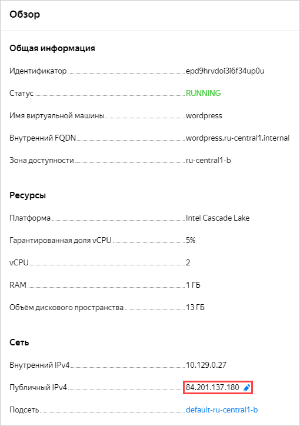
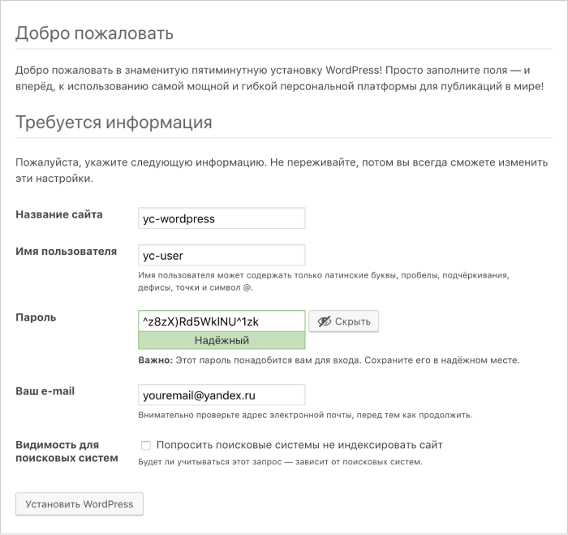

# Создание сайта на WordPress

Чтобы настроить веб-сайт на WordPress:

1. [Создайте виртуальную машину для WordPress](#create-vm)
1. [Настройте WordPress](#wordpress-setup)
1. [Настройте DNS](#configure-dns)

## Подготовка к работе {#before-begin}

Перед тем, как создавать виртуальную машину:

1. Перейдите в [консоль управления](https://console.cloud.yandex.ru) Яндекс.Облака и выберите каталог, в котором будете выполнять операции.
1. Убедитесь, что в выбранном каталоге есть облачная сеть с подсетью хотя бы в одной зоне доступности. Для этого на странице каталога нажмите плитку **Yandex Virtual Private Cloud**. Если в списке есть сеть — нажмите на нее, чтобы увидеть список подсетей. Если нужных подсетей или сети нет, [создайте их](../../vpc/quickstart.md).

## 1. Создание виртуальной машины для WordPress {#create-vm}

Чтобы создать виртуальную машину:

1. На странице каталога в [консоли управления](https://console.cloud.yandex.ru) нажмите кнопку **Создать ресурс** и выберите **Виртуальная машина**.

   

1. В поле **Имя** введите имя виртуальной машины: `wordpress`.

   [!INCLUDE [name-format](../../_includes/name-format.md)]

   

1. Выберите [зону доступности](../../overview/concepts/geo-scope.md), в которой будет находиться виртуальная машина.
1. В блоке **Публичные образы** нажмите кнопку **Выбрать**. Выберите публичный образ **WordPress**.

   

1. В блоке **Вычислительные ресурсы**:
    - Выберите [тип виртуальной машины](../../compute/concepts/vm-types.md) (легкая или стандартная).
    - Укажите необходимое количество vCPU и объем RAM.

   Для тестирования хватит минимальной конфигурации:
   * **Тип ВМ** — легкая.
   * **vCPU** — 1.
   * **RAM** — 1 ГБ.

1. В блоке **Сетевые настройки** нажмите кнопку **Добавить сеть**. 
1. В открывшемся окне выберите, к какой подсети необходимо подключить виртуальную машину при создании.
1. В пункте **Публичный адрес** выберите **Автоматически**. Нажмите кнопку **Выбрать**.

   

1. Укажите данные для доступа на виртуальную машину:
    - В поле **Логин** введите имя пользователя.
    - В поле **SSH ключ** вставьте содержимое файла открытого ключа.
        Пару ключей для подключения по SSH необходимо создать самостоятельно. Подробнее см. [[!TITLE]](../../compute/operations/vm-control/vm-connect-ssh.md).

1. Нажмите кнопку **Создать ВМ**.

Создание виртуальной машины может занять несколько минут. Когда виртуальная машина перейдет в статус `RUNNING`, вы можете начать настраивать сайт.

При создании виртуальной машине назначается публичный IP-адрес и имя хоста (FQDN). Эти данные можно использовать для доступа по SSH.

## 2. Настройка WordPress {#wordpress-setup}

После того как виртуальная машина `wordpress` перейдет в статус `RUNNING`, выполните:
1. В блоке **Сеть** на странице виртуальной машины в [консоли управления](https://console.cloud.yandex.ru) найдите публичный IP-адрес виртуальной машины.

   

1. Перейдите по адресу виртуальной машины в браузере.
1. Выберите язык и нажмите кнопку **Продолжить**.

   

1. Заполните информацию для доступа к сайту:
   1. Укажите любое название сайта, например, `yc-wordpress`.
   1. Укажите имя пользователя, которое будет использоваться для входа в административную панель, например, `yc-user`.
   1. Укажите пароль, который будет использоваться для входа в административную панель.
   1. Укажите вашу электронную почту.

   

1. Нажмите кнопку **Установить WordPress**.
1. Если установка прошла успешно, нажмите кнопку **Войти**.

   

1. Войдите на сайт, используя указанные на прошлых шагах имя пользователя и пароль. После этого откроется административная панель, в которой можно приступать к работе с вашим сайтом.
1. Убедитесь, что сайт доступен, открыв публичный IP-адрес виртуальной машины в браузере.

## 3. Настройка DNS {#configure-dns}

Чтобы привязать сайт к домену, настройте DNS у вашего регистратора следующим образом:

* A-запись: поддомен `@`, в качестве адреса используйте публичный IP-адрес виртуальной машины.
* CNAME-запись: поддомен `www`, в качестве канонического имени используйте домен с точкой на конце, например: `example.com.` 
