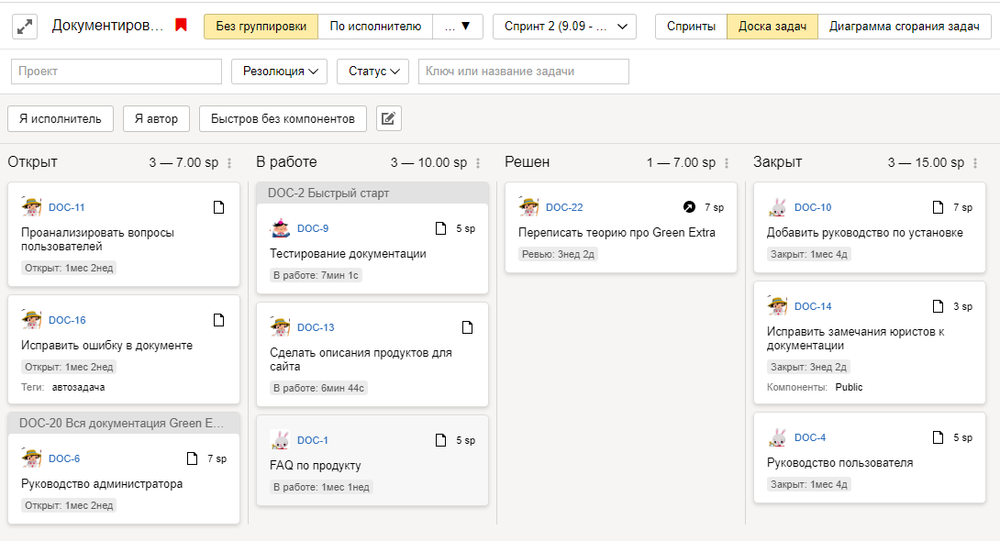

# Инструменты гибкой разработки

В {{ tracker-name }} для управления задачами и проектами вы можете использовать инструменты и подходы гибкой разработки (Agile-инструменты): доску задач, спринты, диаграмму сгорания задач и покер планирования.

@[youtube](D5ZAZOYG28c)

[Гибкие методологии разработки]({{ link-wiki-agile }}) были созданы для управления разработкой программного обеспечения, теперь их успешно применяют в самых разных областях. Существует несколько гибких методологий, например [Скрам]({{ link-wiki-scrum }}) и [Канбан]({{ link-wiki-kanban }}).

Подробнее читайте в разделе [{#T}](agile.md#sec_basics).

## Доски задач в {{ tracker-name }} {#sec_boards}

В {{ tracker-name }} инструменты для гибкой разработки сгруппированы на доске задач.

Работа с досками задач в {{ tracker-name }} похожа на [работу с обычными досками со стикерами](#dlen_board). Используйте доски разных типов для планирования и отслеживания работы по гибким методологиям:

- **Простая** доска позволяет распределить задачи по колонкам в зависимости от их статуса.

- Доска **Скрам**, помимо отображения статусов задач, включает инструменты для управления [спринтами](#dlen_sprint), [оценки сложности задач](planning-poker.md) и [диаграмму сгорания задач](#dlen_burndown).

- Доска **Канбан** — похожа на простую доску, но все задачи в статусе **Открыт** автоматически попадают в колонку [**Бэклог**](#dlen_backlog).

Подробнее о том, как работать с досками задач:

- [{#T}](create-agile-board.md)
- [{#T}](../user/agile.md)
- [{#T}](create-agile-sprint.md)
- [{#T}](planning-poker.md)
- [{#T}](burndown.md)

## Основные понятия гибкой разработки {#sec_basics}

В {{ tracker-name }} используются термины и понятия из методологии [Скрам]({{ link-wiki-scrum }}):

Бэклог {#dlen_backlog}
:   Список задач или требований к продукту, которые нужно реализовать в проекте. Обычно задачи в бэклоге упорядочены по приоритету.

Спринт {#dlen_sprint}
:   Итерация работы над проектом, обычно длится 1–4 недели. Считается, что в каждом спринте команда должна разработать и подготовить к выпуску новые функции продукта (инкремент).

Покер планирования
:   Метод [командной оценки сложности задач](planning-poker.md) с помощью карт, на которые нанесены оценки сложности в относительных единицах [Story Points](#dlen_sp).

Доска задач {#dlen_board}
:   Доска для отслеживания статуса задач в текущем спринте. Столбцы на доске соответствуют статусам задач. Карточки с описанием задач прикрепляются на доску и [перемещаются между столбцами по мере изменения статуса](../user/agile.md).

Диаграмма сгорания задач {#dlen_burndown}
:   График, который [показывает скорость выполнения запланированных задач](burndown.md) в течение спринта и объем оставшейся работы.

User Story
:   <q>Пользовательская история</q> — описание возможности, которую нужно реализовать в продукте, с точки зрения потребностей или проблем пользователя. User Story разбивается на отдельные задачи. В {{ tracker-name }} можно использовать тип задач Story для [группировки любых задач](../user/links.md) с общей темой.

Story Point {#dlen_sp}
:   Относительная единица трудоемкости задач. Обычно единица Strory Point не эквивалентна какому-то определенному количеству человеко-часов. [Команда оценивает задачи совместно](planning-poker.md), сравнивая их с какой-нибудь простой задачей.

Эпик
:   Крупная функция или требование, которое невозможно реализовать за один спринт. Обычно разбивается на несколько историй (User Story) или задач. В {{ tracker-name }} можно использовать тип задач Epic для [группировки любых задач](../user/links.md) с общей темой.

Подэпик
:   Задача, которая входит в эпик.

