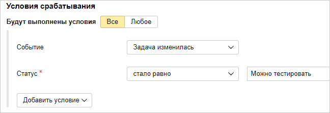

# Примеры

Рассмотрим несколько примеров использования триггеров в {{ tracker-name }}:

- Как [автоматически назначать исполнителя задачи](#assign_ticket) в зависимости от статуса или компонента.

- Как [автоматически призывать исполнителя задачи](#summon_ticket) в зависимости от статуса и значения поля.

- Как [настроить уведомления в мессенджеры](#section_vsn_mb2_d3b) через HTTP-запросы.

## Автоматически назначать исполнителя задачи {#assign_ticket}

Часто за выполнение разных этапов работы отвечают определенные сотрудники. Когда сотрудник выполняет свою часть работы, он передает задачу следующему исполнителю. Если команда ведет работу в {{ tracker-name }}, то каждому этапу работы соответствует статус задачи. Когда задача переходит в определенный статус, с помощью триггера можно автоматически назначать исполнителя, который отвечает за выполнение этого этапа работы.

Другой вариант организации работы — когда выделенные сотрудники отвечают за разные направления. Например, каждый сотрудник службы поддержки работает с обращениями по своему продукту. В этом случае в очереди можно [настроить компоненты](components.md), которые соответствуют продуктам компании. Когда в задачу добавляется определенный компонент, с помощью триггера можно автоматически назначать исполнителя, который отвечает за работу с этим продуктом.

Настроим триггер для автоматического назначения исполнителя задачи:

1. Убедитесь, что у всех сотрудников, которые могут быть назначены исполнителями задач, есть [полный доступ к {{ tracker-name }}](../enable-tracker.md).

1. Перейдите в настройки очереди и в разделе **Триггеры** нажмите кнопку [**Создать триггер**](../user/create-trigger.md).

1. Задайте условия, чтобы триггер срабатывал при изменении параметров задачи <q>Статус</q> или <q>Компоненты</q>:

    1. Выберите опцию **Будут выполнены условия** → **Все**.

    1. Добавьте условие **Событие** → **Задача изменилась**.

    1. Чтобы назначать исполнителя задачи при изменении статуса, добавьте условие **Системные** → **Статус** → **стало равно** и укажите статус.

        

        Чтобы назначать исполнителя задачи при изменении компонентов, добавьте условие **Системные** → **Компоненты** → **стало равно** и укажите компоненты.

        

        

        Триггер с таким условием сработает, только если в задаче указан один компонент.

        

1. Задайте действие триггера: 

    1. Добавьте действие **Изменить значения в полях**.

    1. Выберите поле **Системные** → **Исполнитель** → **Установить значение** и укажите сотрудника, который должен быть назначен исполнителем при срабатывании триггера. 

        

1. Сохраните триггер. 
   Чтобы проверить работу триггера, измените статус или компоненты у любой задачи из очереди, в которой вы настроили триггер.

## Автоматически призывать исполнителя задачи {#summon_ticket}

Выполнив задачу, сотрудник может забыть указать важную информацию, например, затраченное время. В этом случае можно настроить триггер, который будет автоматически призывать испольнителя, если задача закрыта и не указано затраченное время:

1. Перейдите в настройки очереди и в разделе **Триггеры** нажмите кнопку [**Создать триггер**](../user/create-trigger.md).

1. Задайте условия, чтобы триггер срабатывал при закрытии задачи в случае, если поле <q>Затраченное время</q> не заполнено:

    1. Выберите опцию **Будут выполнены условия** → **Все**.

    1. Добавьте условие **Статус** → **стало равно** → **Закрыт**.

    1. Добавьте условие **Затраченное время** → **Значение поля пусто**.

1. Задайте действия триггера:

    1. Добавьте действие **Добавить комментарий**.

    1. Нажмите  и в строке **Призвать пользователей из поля** введите <q>Исполнитель</q>.

    1. Введите текст комментария, который должен увидеть исполнитель, и выберите опцию **Отправлять от имени робота**.

1. Сохраните триггер, нажав кнопку **Создать**.

    

При закрытии любой задачи, где не указано затраченное время, робот будет создавать комментарий и призывать исполнителя.

## Отправлять уведомления в мессенджеры {#section_vsn_mb2_d3b}

Для быстрого оповещения сотрудников о важных событиях удобно использовать мессенджеры. Если у мессенджера есть API, в {{ tracker-name }} можно настроить триггер, который отправляет в API мессенджера HTTP-запросы при наступлении определенных событий. Например, если в очереди создается ошибка с критическим приоритетом.

Примеры настройки триггеров для отправки уведомлений в Slack и Telegram приведены в разделе [{#T}](../messenger.md).

