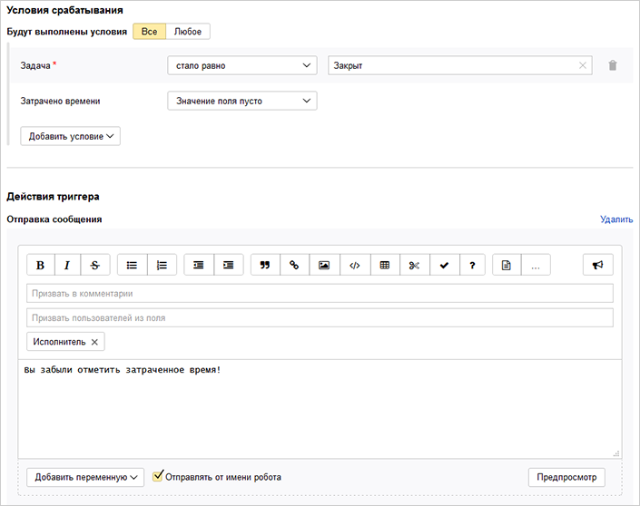
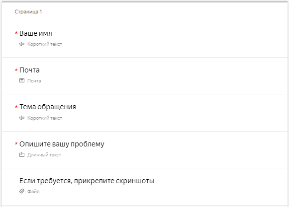

---

__system: {"dislikeVariants":["Нет ответа на мой вопрос","Рекомендации не помогли","Содержание не соответсвует заголовку","Другое"]}
---
# Примеры

Рассмотрим несколько примеров использования триггеров в {{ tracker-name }}:

- Как [автоматически назначать исполнителя задачи](#assign_ticket) в зависимости от статуса или компонента.

- Как [автоматически призывать исполнителя задачи](#summon_ticket) в зависимости от статуса и значения поля.

- Как [автоматически отправлять пользователю уведомление](#notify_mail) после создания задачи из обращения в службу поддержки по почте.

- Как [автоматически отправлять пользователю уведомление](#notify_form) после создания задачи из обращения в службу поддержки через Яндекс.Формы.

- Как [настроить уведомления в мессенджеры](#section_vsn_mb2_d3b) через HTTP-запросы.

## Автоматически назначать исполнителя задачи {#assign_ticket}

Часто за выполнение разных этапов работы отвечают определенные сотрудники. Когда сотрудник выполняет свою часть работы, он передает задачу следующему исполнителю. Если команда ведет работу в {{ tracker-name }}, то каждому этапу работы соответствует статус задачи. Когда задача переходит в определенный статус, с помощью триггера можно автоматически назначать исполнителя, который отвечает за выполнение этого этапа работы.

Другой вариант организации работы — когда выделенные сотрудники отвечают за разные направления. Например, каждый сотрудник службы поддержки работает с обращениями по своему продукту. В этом случае в очереди можно [настроить компоненты](components.md), которые соответствуют продуктам компании. Когда в задачу добавляется определенный компонент, с помощью триггера можно автоматически назначать исполнителя, который отвечает за работу с этим продуктом.

Настроим триггер для автоматического назначения исполнителя задачи:

1. Убедитесь, что у всех сотрудников, которые могут быть назначены исполнителями задач, есть [полный доступ к {{ tracker-name }}](../access.md).

1. Перейдите в настройки очереди и в разделе **Триггеры** нажмите кнопку [**Создать триггер**](../user/create-trigger.md).

1. Введите название триггера. 

1. Задайте условия, чтобы триггер срабатывал при изменении параметров задачи <q>Статус</q> или <q>Компоненты</q>:

    1. Выберите опцию **Будут выполнены условия** → **Все**.

    1. Добавьте условие **Событие** → **Задача изменилась**.

    1. Чтобы назначать исполнителя задачи при изменении статуса, добавьте условие **Системные** → **Статус** → **стало равно** и укажите статус.

        

        Чтобы назначать исполнителя задачи при изменении компонентов, добавьте условие **Системные** → **Компоненты** → **стало равно** и укажите компоненты.

        

        

        Триггер с таким условием сработает, только если в задаче указан один компонент.

        

1. Задайте действие триггера: 

    1. Добавьте действие **Изменить значения в полях**.

    1. Выберите поле **Системные** → **Исполнитель** → **Установить значение** и укажите сотрудника, который должен быть назначен исполнителем при срабатывании триггера. 

        

1. Сохраните триггер. 
   Чтобы проверить работу триггера, измените статус или компоненты у любой задачи из очереди, в которой вы настроили триггер.

## Автоматически призывать исполнителя задачи {#summon_ticket}

Выполнив задачу, сотрудник может забыть указать важную информацию, например, затраченное время. В этом случае можно настроить триггер, который будет автоматически призывать исполнителя, если задача закрыта и не указано затраченное время:

1. Перейдите в настройки очереди и в разделе **Триггеры** нажмите кнопку [**Создать триггер**](../user/create-trigger.md).

1. Введите название триггера.

1. Задайте условия, чтобы триггер срабатывал при закрытии задачи в случае, если поле <q>Затраченное время</q> не заполнено:

    1. Выберите опцию **Будут выполнены условия** → **Все**.

    1. Добавьте условие **Системные** → **Статус** → **стало равно** → **Закрыт**.

    1. Добавьте условие **Учёт Времени** → **Затрачено времени** → **Значение поля пусто**.

1. Задайте действия триггера:

    1. Добавьте действие **Добавить комментарий**.

    1. Нажмите  и в строке **Призвать пользователей из поля** введите <q>Исполнитель</q>.

    1. Введите текст комментария, который должен увидеть исполнитель, и выберите опцию **Отправлять от имени робота**.

1. Сохраните триггер, нажав кнопку **Создать**.

    

При закрытии любой задачи, где не указано затраченное время, робот будет создавать комментарий и призывать исполнителя.

## Отправлять уведомление о создании задачи из письма {#notify_mail}

Предположим, что сотрудники службы поддержки регистрируют обращения в {{ tracker-name }}. Пользователи пишут в службу поддержки по почте, и на основе их писем создаются задачи в {{ tracker-name }}.

Настроим триггер, который после создания задачи будет оправлять пользователю письмо о том, что его обращение зарегистрировано:

#### Шаг 1. Настроить интеграцию с почтой

Чтобы отправлять письма из {{ tracker-name }} и создавать задачи из входящих писем, настройте интеграцию с почтой:

1. [Настройте почтовый адрес для очереди](queue-mail.md#section_gwv_hqb_hgb), в которой будут создаваться задачи по обращениям пользователей.

    Если добавление адреса очереди недоступно, значит у вашей организации нет домена. Домен нужен для создания почтовых ящиков и рассылок, в том числе чтобы создать адрес очереди. Домен можно бесплатно [подключить в сервисе Яндекс.Почта 360 для бизнеса]({{ support-business-domain }}).

2. [Настройте псевдонимы и подписи](queue-mail.md#send_outside), если нужно.

1. Если пользователи не являются сотрудниками организации:

    1. [Разрешите принимать письма с внешних ящиков](queue-mail.md#mail_tasks).

    1. [Разрешите отправку писем из задач на внешние адреса](queue-mail.md#send_outside).

#### Шаг 2. Настроить триггер для отправки писем

Настройте триггер, который при создании новой задачи из письма будет отправлять пользователю уведомление по почте:

1. Перейдите в настройки очереди и в разделе **Триггеры** нажмите кнопку [**Создать триггер**](../user/create-trigger.md).

1. Введите название триггера.

1. Задайте условия, чтобы триггер срабатывал при создании новой задачи из входящего письма:

    1. Выберите опцию **Будут выполнены условия** → **Все**.

    1. Добавьте условие **Событие** → **Создана задача**.

    1. Добавьте условие **Email** → **Создано по письму на адрес** → **Равно строке** и введите почтовый адрес очереди.

    1. Включите опцию **Игнорировать регистр** на случай, если пользователь введет адрес очереди с заглавной буквы.

    

1. В качестве действия триггера задайте отправку письма:

    1. Выберите действие **Добавить комментарий**.

    1. Включите опцию **Письмо**.

    1. В поле **Кому** добавьте переменную с адресом пользователя, от которого пришло обращение. Для этого выберите поле **Кому**, нажмите кнопку **Добавить переменную** и выберите **Email** → **От**.

    1. Напишите текст письма. Вы можете добавить в письмо параметры задачи с помощью кнопки **Добавить переменную**.

    

1. Сохраните триггер. 

    Чтобы проверить работу триггера, отправьте письмо на почтовый адрес очереди.

## Отправлять уведомление о создании задачи через форму {#notify_form}

Предположим, что сотрудники службы поддержки регистрируют обращения в {{ tracker-name }}. Пользователи обращаются в службу поддержки через форму обратной связи, которая создана в сервисе [Яндекс.Формы]({{ link-forms }}). На основе заполненной формы создаются задачи в {{ tracker-name }}.

Настроим триггер, который после создания задачи будет оправлять пользователю письмо о том, что его обращение зарегистрировано:

#### Шаг 1. Настроить интеграцию с почтой

Чтобы отправлять письма из {{ tracker-name }}, настройте интеграцию с почтой:

1. [Настройте почтовый адрес для очереди](queue-mail.md#section_gwv_hqb_hgb), в которой будут создаваться задачи по обращениям пользователей.

   Если добавление адреса очереди недоступно, значит у вашей организации нет домена. Домен нужен для создания почтовых ящиков и рассылок, в том числе чтобы создать адрес очереди. Домен можно бесплатно [подключить в сервисе Яндекс.Почта 360 для бизнеса]({{ support-business-domain }}).

2. [Настройте псевдонимы и подписи](queue-mail.md#send_outside), если нужно.

3. Если пользователи не являются сотрудниками организации, [разрешите отправку писем из задач на внешние адреса](queue-mail.md#send_outside).
   
#### Шаг 2. Настроить форму для регистрации обращений

Чтобы создавать задачи из обращений через форму:

1. Перейдите в сервис [Яндекс.Формы]({{ link-forms }}) и создайте новую форму.

1. Добавьте на форму вопросы, чтобы пользователь мог сообщить информацию, которая нужна для регистрации обращения.

    Чтобы узнать почтовый адрес пользователя, добавьте вопрос **Почта** и сделайте его обязательным.

    

1. Настройте для формы [интеграцию с {{ tracker-name }}]({{ support-forms-tracker }}):        

    1. Укажите очередь и другие параметры задачи.

    1. В поле **Описание задачи** добавьте ответы на вопросы формы.

    1. Чтобы сохранить в параметрах задачи почтовый адрес пользователя, добавьте поле **От** и выберите **Переменные** → **Ответ на вопрос** → **Почта**.
        
    1. Сохраните параметры интеграции.        

    

1. [Опубликуйте]({{ support-forms-publish }}) форму.

#### Шаг 3. Настроить триггер для отправки писем

Настройте триггер, который при создании новой задачи через форму будет отправлять пользователю уведомление по почте :

1. Перейдите в настройки очереди и в разделе **Триггеры** нажмите кнопку [**Создать триггер**](../user/create-trigger.md).

1. Введите название триггера.

1. Задайте условия, чтобы триггер срабатывал при создании новой задачи из входящего письма:

    1. Выберите опцию **Будут выполнены условия** → **Все**.

    1. Добавьте условие **Событие** → **Создана задача**.

    1. Добавьте условие **Email** → **От** → **Значение поля установлено**.

    

1. В качестве действия триггера задайте отправку письма:

    1. Выберите действие **Добавить комментарий**.

    1. Включите опцию **Письмо**.

    1. В поле **Кому** добавьте переменную с адресом пользователя, от которого пришло обращение. Для этого выберите поле **Кому**, нажмите кнопку **Добавить переменную** и выберите **Email** → **От**.

    1. Напишите текст письма. Вы можете добавить в письмо параметры задачи с помощью кнопки **Добавить переменную**.

    

1. Сохраните триггер. 

    Чтобы проверить работу триггера, заполните форму, в которой вы настроили интеграцию с {{ tracker-name }}.

## Отправлять уведомления в мессенджеры {#section_vsn_mb2_d3b}

Для быстрого оповещения сотрудников о важных событиях удобно использовать мессенджеры. Если у мессенджера есть API, в {{ tracker-name }} можно настроить триггер, который отправляет в API мессенджера HTTP-запросы при наступлении определенных событий. Например, если в очереди создается ошибка с критическим приоритетом.

Примеры настройки триггеров для отправки уведомлений в Slack и Telegram приведены в разделе [{#T}](../messenger.md).

