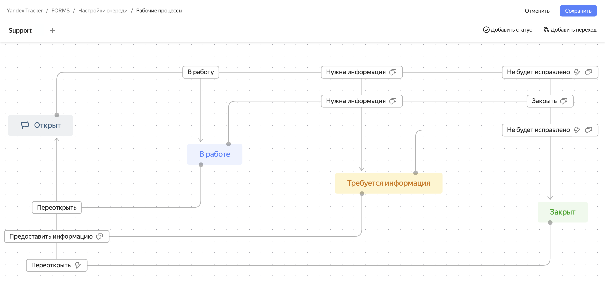

# Обзор

Рабочий процесс в очереди — это набор статусов, которые сменяются на разных этапах выполнения задачи, и правила переходов между этими статусами.

## Из чего состоит рабочий процесс {#inside-the-workflow}

Рабочий процесс характеризуется следующими сущностями {{ tracker-name }}:

* [Типы задач](add-ticket-type.md) — в очереди может быть несколько типов задач, например, <q>Новая возможность</q>, <q>Улучшение</q> или <q>Ошибка</q>. Рабочие процессы настраивают для конкретных типов задач в очереди, что позволяет учитывать особенности типов задач и создавать для каждого типа удобный рабочий процесс.
* [Статусы](workflow-status-edit.md) задач и [резолюции](create-resolution.md) — рабочий процесс определяет, какие статусы будут в задачах выбранного типа и с какими резолюциями их будут закрывать.
* [Переходы](workflow-action-edit.md) между статусами — с помощью переходов можно настроить не только элементарные правила изменения статусов задачи, но также автоматические действия, которые будут выполняться при изменении статуса, и экраны переходов, чтобы пользователи заполняли некоторые поля задачи.

На схеме в визуальном редакторе рабочих процессов статусы — это более крупные блоки, раскрашенные цветами, соответствующими [типам статусов](./workflow-status-edit.md#status-types), а небольшие прозрачные блоки — переходы между статусами.

Больше полезной информации про настройку рабочих процессов и автоматизаций в {{ tracker-name }} — в нашем вебинаре:

 @[youtube](https://www.youtube.com/watch?v=NMTUPaom4WA)

## Где находятся рабочие процессы очереди? {#where-workflows}

Рабочие процессы хранятся в настройках очереди, поэтому доступ к ним есть только у владельца очереди и пользователи, которым владелец выдал [доступ к настройкам очереди](queue-access.md).

Чтобы просмотреть рабочие процессы очереди:

1. На панели {{ tracker-name }} слева нажмите Очереди и перейдите на страницу очереди.

1. В верхнем правом углу нажмите  **{{ ui-key.startrek.ui_components_PageQueue_header.settings }}**.

1. Перейдите на вкладку **{{ ui-key.startrek.ui_components_page-queue-admin_QueueAdminPageContent.menu-item-workflows }}**.

На вкладке содержится список всех рабочих процессов очереди.

## При создании очереди нужно cразу создавать рабочий процесс? {#first-process}

Нет, при [создании очереди](create-queue.md) используется [шаблон со стандартным рабочим процессом](workflows.md). Этот рабочий процесс сразу начинает действововать в задачах очереди. В редакторе рабочих процессов владелец очереди может посмотреть на схеме, как устроен рабочий процесс, скорректировать его или создать новые процессы для новых типов задач.
