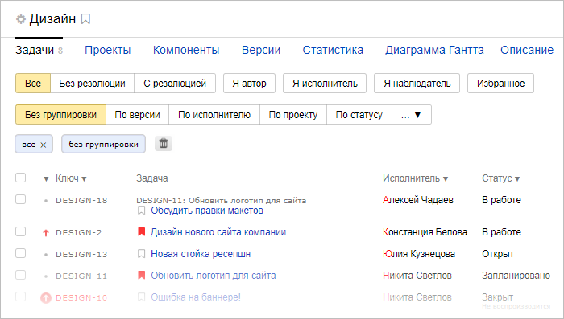

# Настроить очередь

Каждая задача в {{ tracker-name }} входит в одну из очередей. Очередь — это пространство для задач, объединенных общим процессом или продуктом. Также очередь можно представить как список задач для определенной команды или отдела.

Очереди помогают упорядочить задачи и понять, кто отвечает за их выполнение. Например, можно создать отдельные очереди для отдела кадров, команды проекта и службы поддержки.

В каждой очереди можно настроить свой процесс работы с задачами. Чтобы настроить рабочий процесс, в очереди нужно задать этапы выполнения задач (статусы) и последовательность этих этапов — [воркфлоу](manager/workflow.md). Для распространенных процессов в {{ tracker-name }} предусмотрены [шаблоны очередей](manager/workflows.md).

Чтобы сделать работу с задачами очереди более эффективной, используйте дополнительные возможности:

- Настройте [автоматизацию рутинных действий](automation.md).
- Настройте интеграцию с  [{{ forms-full-name }}](manager/forms-integration.md).
- Настройте [права доступа к задачам очереди](manager/queue-access.md).
- Структурируйте задачи очереди с помощью [проектов](manager/projects.md), [компонентов](manager/components.md) и [версий](manager/versions.md).

Чтобы узнать, как можно адаптировать очередь для вашего процесса, прочитайте [пример настройки очереди для службы поддержки](support-process.md).

