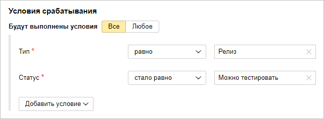
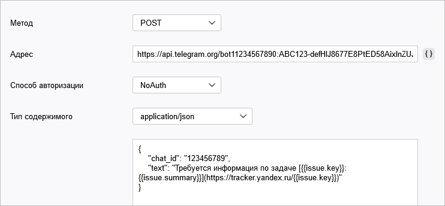

---

__system: {"dislikeVariants":["Нет ответа на мой вопрос","Рекомендации не помогли","Содержание не соответсвует заголовку","Другое"]}
---
# Telegram

Предположим, что нужно автоматически отправлять уведомления в мессенджер, когда у задачи меняется статус. Например, чтобы отслеживать готовность релизов к тестированию. Для этого можно [настроить триггер](user/trigger.md), который будет отслеживать статусы задач типа <q>Релиз</q> и отправлять HTTP-запрос, когда статус задачи изменится на <q>Можно тестировать</q>.

В мессенджере Telegram для автоматической отправки сообщений в групповые чаты и отдельным пользователям используются боты. Чтобы отправлять уведомления из {{ tracker-name }} в Telegram, создайте телеграм-бота и настройте триггер, который будет отправлять сообщения от имени бота с помощью HTTP-запросов.

## Шаг 1. Настройка телеграм-бота {#bot-setup}

1. Создайте нового телеграм-бота:

    1. В мессенджере Telegram добавьте в контакты бота `@BotFather` и отправьте ему сообщение `/start`.

    1. Отправьте боту сообщение `/newbot` и следуйте инструкциям: придумайте для бота отображаемое имя (например, `My Company`) и имя аккаунта (например, `MyCompanyBot`). Имя аккаунта должно иметь окончание `bot`.

    В ответ вы получите сообщение об успешном создании бота. В сообщении будет указан токен — секретный код, который потребуется для обращения к вашему боту через API. Токен имеет вид `1234567890:ABC123-defHIJ...`

1. Добавьте созданного бота в групповой чат Telegram, в который вы хотите отправлять оповещения из {{ tracker-name }}.
    Если вы хотите получать оповещения из {{ tracker-name }} в личных сообщениях, начните чат с ботом.

1. Узнайте идентификатор чата Telegram, в который вы хотите отправлять оповещения. Для этого можно использовать специальных ботов, например `@myidbot`:
    - Чтобы узнать идентификатор группового чата, добавьте в этот чат бота и отправьте ему сообщение `/getgroupid`. Обратите внимание, что идентификатор группового чата начинается с минуса `-`. 
    - Чтобы узнать идентификатор вашего аккаунта для отправки личных сообщений, начните чат с ботом и отправьте ему сообщение `/getid`. 


Подробнее о настройке телеграм-бота можно узнать на сайте [https://core.telegram.org/bots](https://core.telegram.org/bots).

## Шаг 2. Настройка {{ tracker-name }} {#tracker-setup}

1. Авторизуйтесь в {{ tracker-name }}. У вас должны быть права на администрирование очереди, для которой вы будете настраивать триггер.

1. Перейдите в настройки очереди и в разделе **Триггеры** нажмите кнопку [**Создать триггер**](user/create-trigger.md).

1. Введите название триггера, например <q>Уведомления в Telegram</q>.

1. Настройте условия срабатывания триггера так, чтобы он срабатывал, когда задача типа **Релиз** переходит в статус **Можно тестировать**:

    1. Выберите опцию **Будут выполнены условия** → **Все**.

    1. Добавьте условие **Тип** → **равно** → **Релиз**.
    
    1. Добавьте условие **Статус** → **стало равно** → **Можно тестировать**.
    
    

1. Нажмите кнопку **Добавить действие** и выберите **HTTP-запрос**.

1. Настройте запрос:
    - Метод — **POST**.
    - Адрес: `https://api.telegram.org/bot<токен>/sendMessage`
        В адрес подставьте значение токена, который вы получили при [настройке телеграм-бота](#bot-setup).
    - Способ авторизации — **NoAuth**.
    - Тип содержимого — **application/json**.
    - Тело запроса:
        ```
        {
            "chat_id": "<ID чата>",
            "text": "Пора тестировать задачу [not_var{{issue.key}}: not_var{{issue.summary}}](https://tracker.yandex.ru/not_var{{issue.key}})"
        }
        ```
        В качестве значения параметра `chat_id` укажите идентификатор чата, который вы получили при [настройке телеграм-бота](#bot-setup).
        Чтобы добавить в тело запроса значения полей задачи, справа от поля ввода нажмите кнопку **{ }** и выберите имя поля.
    - Заголовки оставьте пустыми.
    
    

    Если вы хотите использовать в HTTP-запросе другие методы и параметры, вы можете найти описание API телеграм-ботов на сайте [https://core.telegram.org/bots/api](https://core.telegram.org/bots/api).

    

    

1. Сохраните триггер.


Чтобы проверить работу триггера, переведите задачу типа **Релиз** в статус **Можно тестировать**. Триггер отправит в чат Telegram сообщение c текстом: <q>Пора тестировать задачу TEST-123: Настроить триггеры (https://tracker.yandex.ru/TEST-123)</q>.

