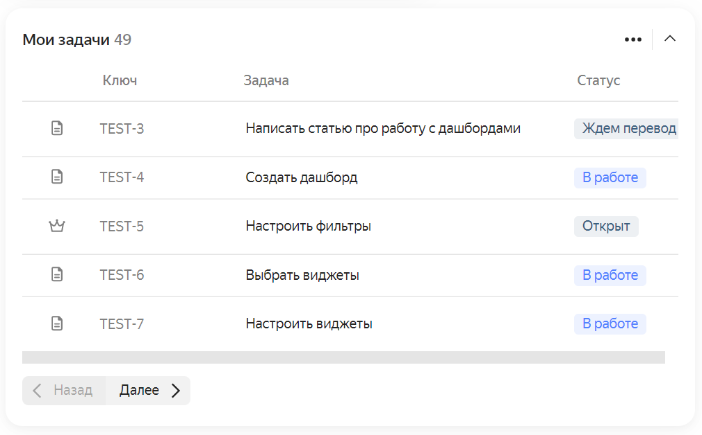
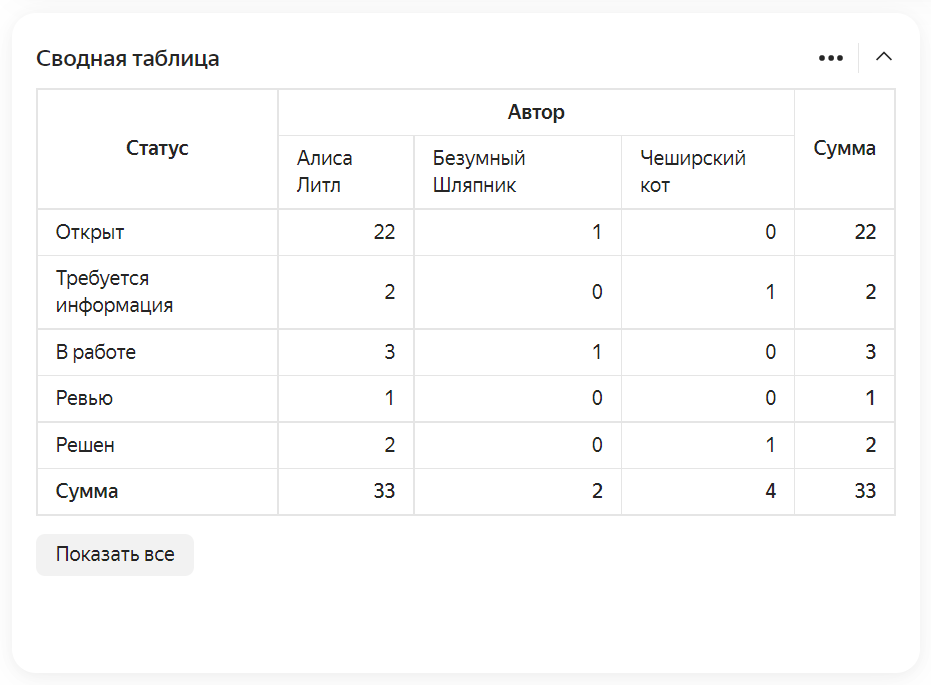
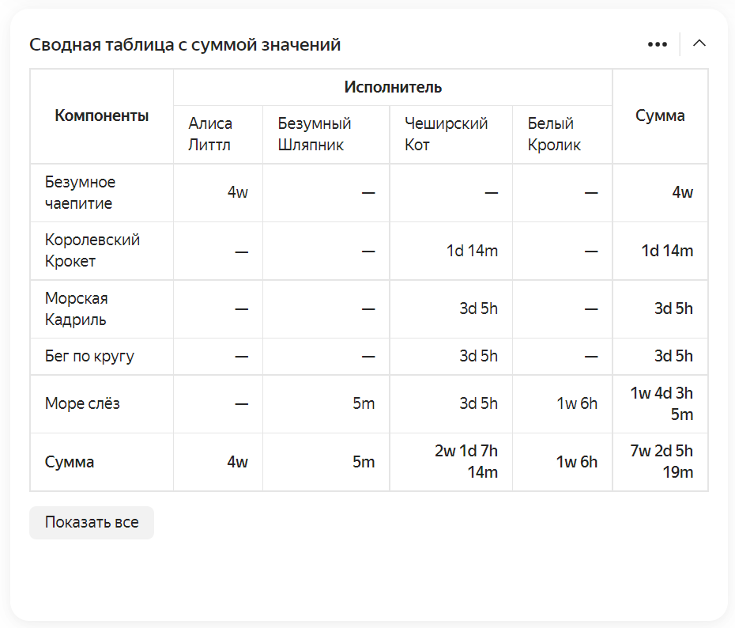
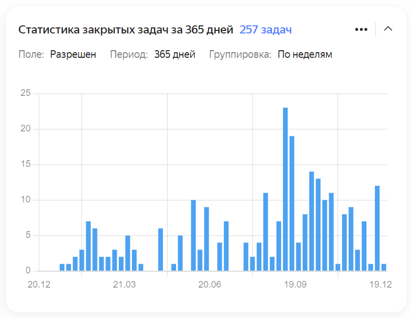
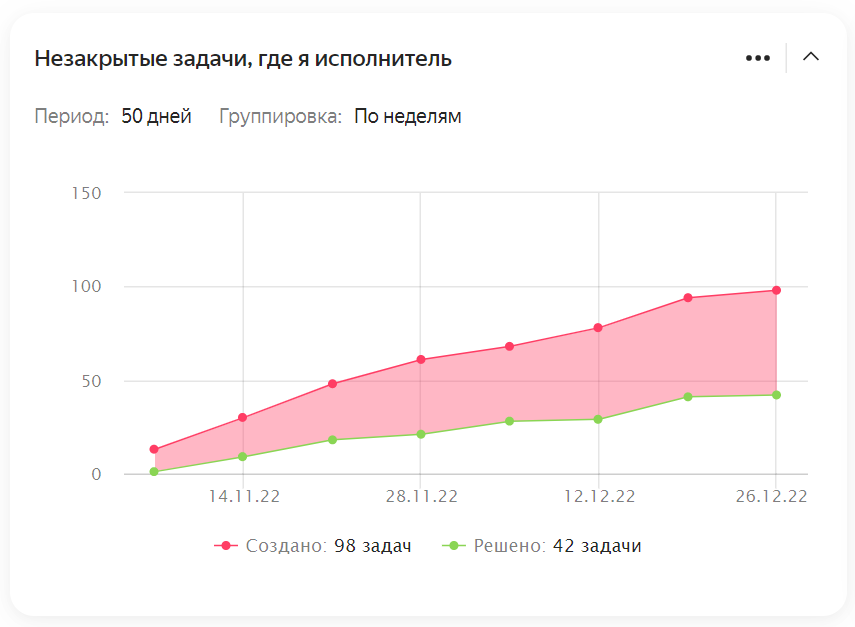
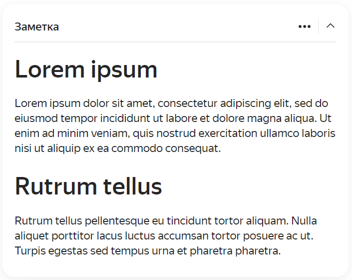

# Виджеты

Виджеты — небольшие карточки с полезной информацией. Это могут быть списки задач, статистика их выполнения, сводные таблицы или заметки. Содержимое виджетов генерируется автоматически. Список задач, на основе которого формируется виджет, задается с помощью [фильтра](filters.md). Примеры виджетов для дашборда службы поддержки можно найти в разделе [{#T}](../support-process-dashboards.md).

## Списки задач {#section_ll1_zdp_pz}

Виджет позволяет просматривать список задач, удовлетворяющих определенному фильтру. С помощью таких виджетов вы можете на одной странице просматривать, например, задачи определенной очереди и задачи, над которыми вы сейчас работаете.

Чтобы настроить виджет, задайте его параметры:

- **Название** — название, которое отображается в заголовке виджета.
- **Результаты** — количество задач которые отображаются на одной странице виджета. Если задач окажется больше, вы сможете воспользоваться переключателем страниц в нижней части виджета.
- **Фильтр** — фильтр, на основе которого формируется список задач. Вы можете задать фильтр с помощью [прямой ссылки](filters.md), [имени](create-filter.md) или [языка запросов](query-filter.md).
- **Столбцы** — поля задач, которые отображаются в списке. Вы можете добавить несколько полей. Чтобы удалить поле, нажмите на значок **х**.
- **Автообновление** — периодичность, с которой обновляются данные в виджете.

## Сводные таблицы {#section_esm_vjp_pz}

Сводные таблицы автоматически собирают статистику по задачам и предоставляют ее в табличном виде. {{ tracker-name }} поддерживает несколько типов сводных таблиц:

#### Простая сводная таблица

Простая сводная таблица, которая позволяет просматривать статистику задач по двум любым параметрам. На пересечениях таблицы приводится количество задач, удовлетворяющих параметрам. С помощью такой таблицы вы можете, например, отслеживать количество и статусы задач определенной группы исполнителей.

Чтобы настроить виджет, задайте его параметры:

- **Название виджета** — название, которое отображается в заголовке виджета.

- **Фильтр**. Статистика собирается по задачам, удовлетворяющим определенному фильтру. Вы можете задать фильтр с помощью [прямой ссылки](filters.md), [имени](create-filter.md) или [языка запросов](query-filter.md).

- **Столбцы** — параметр, по которому строятся столбцы таблицы.

- **Строки** — параметр, по которому строятся строки таблицы.

- **Количество строк на странице** — максимальное количество строк таблицы, которые отображаются в виджете. Если строк окажется больше, вы сможете воспользоваться кнопкой **Показать все** в нижней части виджета.

- **Сортировка** — порядок сортировки строк таблицы.

- **Показывать сумму** — если опция включена, таблица содержит сумму значений по строкам и столбцам.

- **Автообновление** — периодичность, с которой обновляются данные в виджете.

#### Сводная таблица с суммой значений

Особый вид сводной таблицы по двум параметрам. В отличие от простой сводной таблицы, на пересечениях приводится не число задач, а сумма значений третьего параметра. С помощью такой таблицы вы можете, например, отслеживать время, которое исполнители затратили на работу над различными компонентами очереди.

Чтобы настроить виджет, задайте его параметры:

- **Название виджета** — название, которое отображается в заголовке виджета.

- **Фильтр**. Статистика собирается по задачам, удовлетворяющим определенному фильтру. Вы можете задать фильтр с помощью [прямой ссылки](filters.md), [имени](create-filter.md) или [языка запросов](query-filter.md).

- **Столбцы** — параметр, по которому строятся столбцы таблицы.

- **Строки** — параметр, по которому строятся строки таблицы.

- **Ячейки** — параметр, сумма значений которого приводится на пересечениях.

- **Количество строк на странице** — максимальное количество строк таблицы, которые отображаются в виджете. Если строк окажется больше, вы сможете воспользоваться кнопкой **Показать все** в нижней части виджета.

- **Сортировка в строках** — порядок сортировки строк таблицы.

- **Сортировка в столбцах** — порядок сортировки столбцов таблицы.

- **Показывать сумму** — если опция включена, таблица содержит сумму значений по строкам и столбцам.

- **Автообновление** — периодичность, с которой обновляются данные в виджете.

## Статистика {#section_htb_kvp_pz}

Виджеты статистики собирают информацию по задачам и предоставляют ее в виде графиков и диаграмм. {{ tracker-name }} поддерживает несколько виджетов статистики:

#### Статистика по задачам

Виджет отображает распределение задач по значениям определенного параметра.

Чтобы настроить виджет, задайте параметры:

- **Название** — название, которое отображается в заголовке виджета.

- **Фильтр**. Статистика собирается по задачам, удовлетворяющим определенному фильтру. Вы можете задать фильтр с помощью [прямой ссылки](filters.md), [имени](create-filter.md) или [языка запросов](query-filter.md).

- **Количество строк на странице** — максимальное количество строк диаграммы, которые отображаются в виджете. Если строк окажется больше, вы сможете воспользоваться кнопкой **Показать все** в нижней части виджета.

- **Ключевой параметр** — параметр задач, по которому собирается статистика.

- **Сортировка** — порядок сортировки столбцов диаграммы.

- **Автообновление** — периодичность, с которой обновляются данные в виджете.

#### График событий

На графике отображается статистика _событий_, произошедших с задачами за определенный период времени. Вы можете выбрать одно из событий:

- Работа над задачей завершена. Событие определяется по параметру **Дата завершения**.

- Работа над задачей начата. Событие определяется по параметру **Дата начала**.

- Последнее обновление задачи.

- Последний комментарий под задачей.

- Задача переведена в статус **Решен**.

- Задача создана.

Чтобы настроить виджет, задайте параметры:

- **Название** — название, которое отображается в заголовке виджета.

- **Фильтр**. Статистика собирается по задачам, удовлетворяющим определенному фильтру. Вы можете задать фильтр с помощью [прямой ссылки](filters.md), [имени](create-filter.md) или [языка запросов](query-filter.md).

- **Ключевой параметр** — выберите событие, которое отслеживается в статистике.

- **Группировка** — выберите шаг и укажите период для сбора статистики.

- **Показывать итог** — если опция включена, в каждом последующем шаге учитываются данные, накопленные за предыдущие.

- **Автообновление** — периодичность, с которой обновляются данные в виджете.

#### График <q>Создано/Решено</q>

График позволяет сравнить количество созданных и закрытых задач. Вы можете указать период и шаг для сбора статистики.

Чтобы настроить виджет, задайте параметры:

- **Название** — название, которое отображается в заголовке виджета.

- **Фильтр**. Статистика собирается по задачам, удовлетворяющим определенному фильтру. Вы можете задать фильтр с помощью [прямой ссылки](filters.md), [имени](create-filter.md) или [языка запросов](query-filter.md).

- **Группировка** — выберите шаг и укажите период для сбора статистики.

- **Отображать тренд** — если опция включена, под графиком отображается линия тренда.

- **Суммировать значения** — если опция включена, в каждом последующем шаге учитываются данные, накопленные за предыдущие.

- **Версии** — если опция включена, на графике отображаются версии, к которым относятся задачи.

## Заметки {#section_rtw_3gr_pz}

Записывайте свои идеи и делайте пометки прямо на дашборде. Вы можете делать записи простым текстом или использовать [Вики-разметку](wiki-markup.md).

## Форма приглашения {#invite_form}

Отправляйте вашим сотрудникам приглашения в {{ tracker-name }} с помощью виджета. Для входа им потребуется аккаунт на Яндексе. Приглашенные сотрудники могут бесплатно использовать {{ tracker-name }} в режиме [<q>Только чтение</q>](../access.md#readonly).