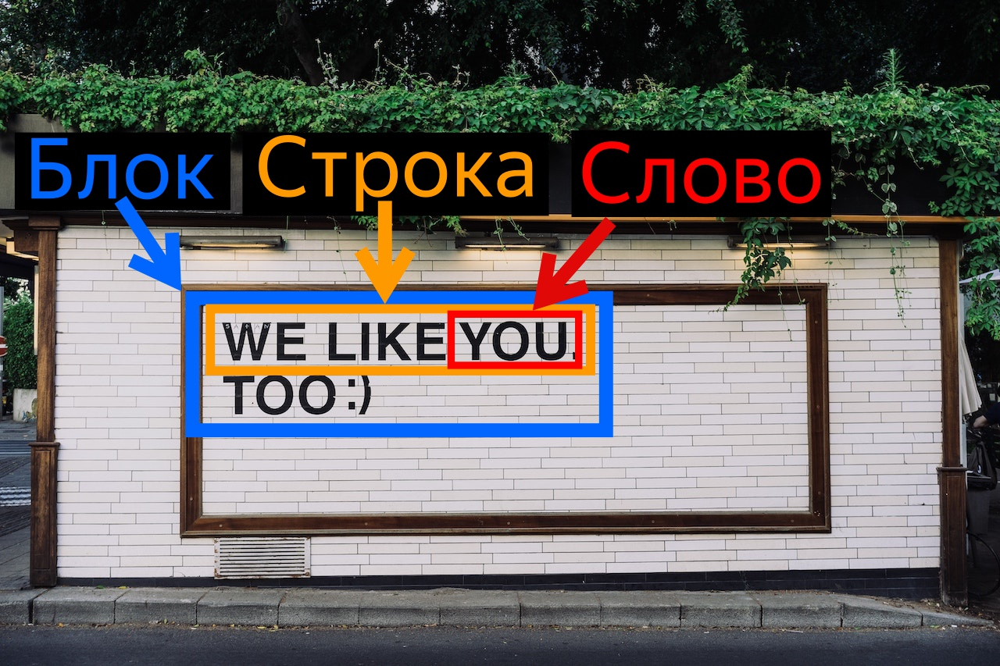

# Оптическое распознавание текста (OCR)

В этом разделе описано, как работает возможность _распознавание текста_ (Optical Character Recognition, OCR) в сервисе.

## Процесс распознавания текста

Распознавание текста на изображении состоит из двух этапов:

1. [Определение языковой модели для распознавания текста](#detect-model).
1. [Поиск текста на изображении](#detect-text).

В результате распознавания сервис вернет JSON-объект с распознанным текстом, его расположением на странице и [достоверностью распознавания](#confidence).

### Определение языковой модели {#detect-model}

В запросе вы указываете языки для распознавания. Список языков и их порядок влияют на выбор модели и качество распознавания. Сервис попытается распознать китайский в арабском и осмысленного результата не получится. Подробнее в разделе [{#T}](supported-languages.md).



Для текста на русском и английском, не указывайте лишние языки в конфигурации — [англо-русская модель](supported-languages.md#engrus) работает лучше.



### Поиск текста на изображении {#detect-text}

Сервис выделяет найденный текст на изображении и группирует его по уровням: слова группируются в строки, строки в блоки, блоки в страницы.



В результате сервис возвращает JSON-объект, где для каждого из уровней дополнительно указывается:

* страницы (`pages[]`) — размер страницы;
* блоки текста (`blocks[]`) — расположение текста на странице;
* строки (`lines[]`) — расположение и [достоверность распознавания](#confidence);
* слова (`words[]`) — расположение, достоверность, текст и язык, использованный при распознавании.

Чтобы показать расположение текста, сервис возвращает координаты прямоугольника, обрамляющего текст. Координаты — количество пикселей от левого верхнего угла на изображении.



Пример распознанного слова с координатами:

```json
{
  "boundingBox": {
    "vertices": [{
        "x": "410",
        "y": "404"
      },
      {
        "x": "410",
        "y": "467"
      },
      {
        "x": "559",
        "y": "467"
      },
      {
        "x": "559",
        "y": "404"
      }
    ]
  },
  "languages": [{
    "languageCode": "en",
    "confidence": 0.9412244558
  }],
  "text": "you",
  "confidence": 0.9412244558
}
```

## Требования к изображению

Изображение в запросе должно соответствовать следующим требованиям:



## Достоверность распознавания {#confidence}

Достоверность распознавания показывает уверенность сервиса в результате. Например, значение `"confidence": 0.9412244558` для строки <q>we like you</q> означает, что с вероятностью в 94% текст распознан корректно.

Сейчас достоверность считается только для строк. В значение `confidence` для слов и языка подставляется значение для `confidence` строки.

#### Что дальше

* [Посмотрите список поддерживаемых языков и моделей](supported-languages.md)
* [Посмотрите известные ограничения в текущей версии](known-issues.md)
* [Попробуйте распознать текст на картинке](../../operations/ocr/text-detection.md)

